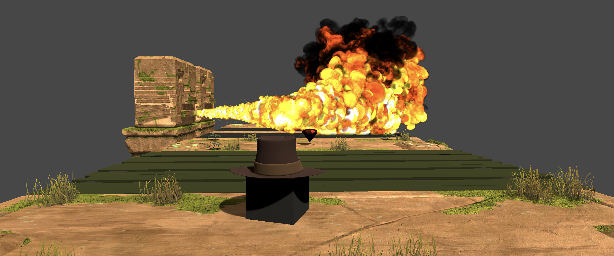
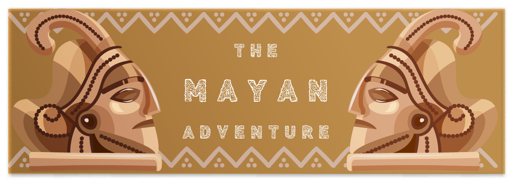

# The Mayan Adventure

The Mayan Adventure is an open-source reinforcement learning environment for Unity ML-Agents.  In this environment, you train your agent (Indie) to find the golden statue in this dangerous environment full of traps.

You can see the trained agent result here: [Link to the video](https://youtu.be/kKng-vRy6bs)

  
This environment is part of Unity ML Agents Course. A free course where you learn to create agents in Unity ML using Deep Reinforcement Learning with Tensorflow.

This project is currently in beta. You can check the todo section to see what will be the future improvements.

Have fun!

## Companion article
We wrote a companion article to explain how the environment works and how you can train the agent.

The Article : https://towardsdatascience.com/unity-ml-agents-the-mayan-adventure-2e15510d653b

## Documentation
### Setup
You need to have Unity and MLAgents installed, if it’s not the case check [Unity ML Installation documentation](https://github.com/Unity-Technologies/ml-agents/blob/master/docs/Installation.md).

To install The Mayan Adventure, you just need to clone this repository and in Unity Hub, add the Folder Mayan Adventure.

### Train and Replay
Please check the article

The Article: [Sent to publication]

## Todo section
As said, this is the beta version, there are still a lot of things to improve:
- Adding randomness in the generation of the level.
- Adding visual version of the training agent.
- Fire Level: turn on/off every 3 seconds.
- New levels:
  - Jump Level
  - Rolling Ball Level

## License

Some assets of the Mayan Adventure where taken from assets packs:
- [3D Game Kit](https://assetstore.unity.com/packages/templates/tutorials/3d-game-kit-115747): A fantastic environment created by Unity, I use their rock platforms, buttons, pillars.
- [Unity Particle Pack](https://assetstore.unity.com/packages/essentials/tutorial-projects/unity-particle-pack-127325): I used it for the fire system.
- [Creator kit: puzzle](https://assetstore.unity.com/packages/templates/tutorials/creator-kit-puzzle-149311): For the win particle fireworks.
- [Skybox series free](https://assetstore.unity.com/packages/2d/textures-materials/sky/skybox-series-free-103633)

- The other elements, wood bridge, and animation, rock heads, golden statue, fedora, etc were made with Blender.

